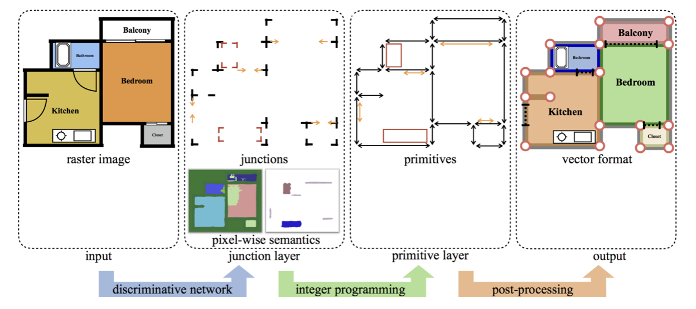
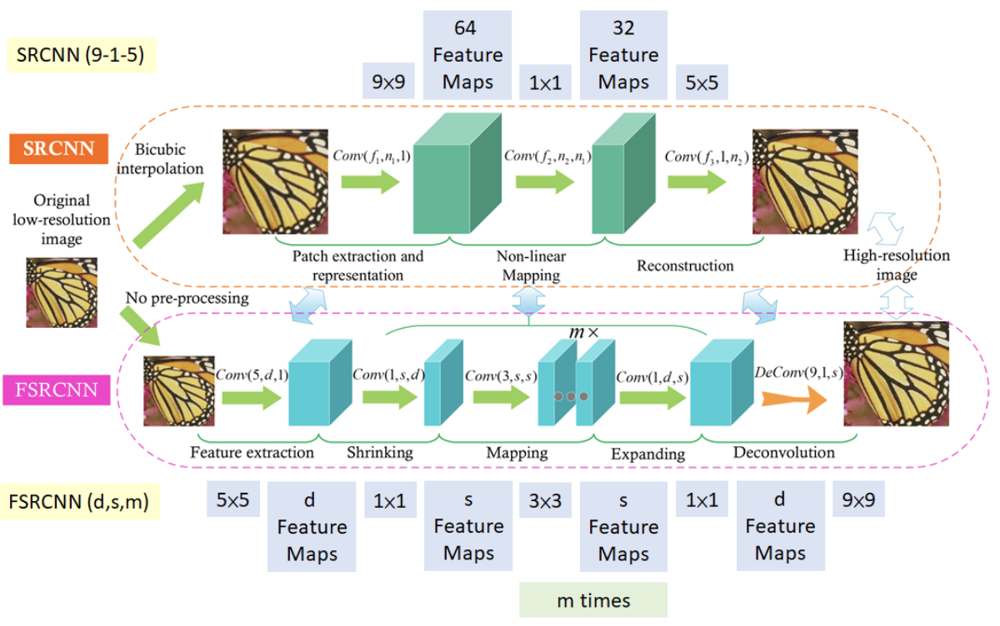
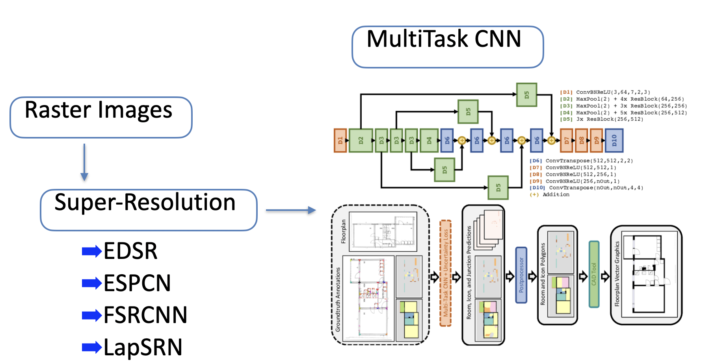

# Floor-Plan-Detection
This project was made to explore the performance of a stacked module comprizing of -
* An object detection model to find wall, icon and room polygons from a floor plan image. 
link: https://github.com/CubiCasa/CubiCasa5k.git
* A super-resoultion model to upscale the image before detection.
link: https://learnopencv.com/super-resolution-in-opencv/

## Conversion of Raster to Vector
The detection model is capable of converting a raster image that contains floor plan objects into a vector format containing polygonal information. The approach uses a network inspired by the ResNet- 152 architecture. The problem is subdivided into three sections that are solved simultaneously; this makes the neural network a multi-tasking CNN. The multi-tasking aspect becomes clear after looking at the use of junction point orientations in the form of heatmaps. This means of point detection allows for precise detection of the wall skeleton in floor plan images.


## Preliminary Step
This work performs super-resolution for image enhancement before detecting floor plan icons and room types; stacking super-resolution frameworks with the CubiCasa architecture results in a multi-component module that does just this. The networks chosen for super-resolution here are
* EDSR
* ESPCN
* FSRCNN
* LapSRN

The process of super-resolution can drastically change the latency of the module. The image below explains the process of image upscaling approached in two ways, SRCNN and FSRCNN respectively. The difference in network structure resulted in not just an improved result but also lower latency. 


## Stacking object detection with Super-Resolution


### Results
The module was tested on 100 images from the [CubiCasa5k][CubiCasa5k] dataset that had sizes less that 800x800. This was done to test the influence of super-resolution on low resolution images. The results are varied for different rooms and icons. On average there is an improvement of approximately 12% using any super-resolution method. 


* Room detection results -

|          |            | Background   | Outdoor      | Wall         | Kitchen      | Living Room  | Bed Room     | Bath         | Entry        | Railing      | Storage      | Garage       | Undefined    | micro avg    |
|----------|------------|--------------|--------------|--------------|--------------|--------------|--------------|--------------|--------------|--------------|--------------|--------------|--------------|--------------|
| [ESPCN][ESPCN]    | precision  | 0.638        | 0.532        | 0.17         | 0.336        | 0.551        | 0.481        | 0.233        | 0.27         | 0.601        | 0.494        | 0.942        | 0.24         | 0.46         |
|          | recall     | 0.704        | 0.537        | 0.189        | 0.482        | 0.55         | 0.558        | 0.411        | 0.457        | 0.417        | 0.577        | 0.948        | 0.418        | 0.46         |
|          | f1-score   | 0.636        | 0.459        | 0.17         | 0.304        | 0.459        | 0.449        | 0.199        | 0.253        | 0.331        | 0.438        | 0.904        | 0.207        | 0.46         |
| [EDSR][EDSR]     | precision  | 0.638        | 0.542        | 0.169        | 0.336        | 0.529        | 0.47         | 0.232        | 0.269        | 0.567        | 0.494        | 0.931        | 0.239        | 0.461        |
|          | recall     | 0.703        | 0.537        | 0.187        | 0.483        | 0.554        | 0.557        | 0.41         | 0.456        | 0.417        | 0.577        | 0.948        | 0.416        | 0.461        |
|          | f1-score   | 0.637        | 0.458        | 0.169        | 0.304        | 0.45         | 0.437        | 0.198        | 0.251        | 0.33         | 0.438        | 0.904        | 0.21         | 0.461        |
| [FSRCNN][FSRCNN]   | precision  | 0.638        | 0.542        | 0.169        | 0.338        | 0.532        | 0.481        | 0.245        | 0.268        | 0.589        | 0.493        | 0.943        | 0.239        | 0.459        |
|          | recall     | 0.703        | 0.536        | 0.188        | 0.483        | 0.549        | 0.557        | 0.41         | 0.453        | 0.42         | 0.577        | 0.948        | 0.415        | 0.459        |
|          | f1-score   | 0.635        | 0.469        | 0.168        | 0.304        | 0.448        | 0.448        | 0.21         | 0.251        | 0.332        | 0.437        | 0.905        | 0.208        | 0.459        |
| [LapSRN][LapSRN]   | precision  | 0.64         | 0.554        | 0.17         | 0.346        | 0.528        | 0.467        | 0.221        | 0.278        | 0.615        | 0.495        | 0.943        | 0.24         | 0.46         |
|          | recall     | 0.702        | 0.535        | 0.189        | 0.485        | 0.551        | 0.555        | 0.412        | 0.46         | 0.418        | 0.576        | 0.948        | 0.416        | 0.46         |
|          | f1-score   | 0.636        | 0.469        | 0.17         | 0.309        | 0.448        | 0.435        | 0.199        | 0.255        | 0.331        | 0.438        | 0.905        | 0.208        | 0.46         |
| Original | precision  | 0.56         | 0.282        | 0.093        | 0.153        | 0.23         | 0.287        | 0.159        | 0.207        | 0.491        | 0.479        | 0.91         | 0.183        | 0.305        |
|          | recall     | 0.522        | 0.593        | 0.122        | 0.65         | 0.503        | 0.708        | 0.901        | 0.924        | 0.615        | 0.887        | 0.989        | 0.779        | 0.305        |
|          | f1-score   | 0.521        | 0.227        | 0.088        | 0.142        | 0.185        | 0.238        | 0.148        | 0.207        | 0.353        | 0.455        | 0.910        | 0.159        | 0.305        |

* Icon detection results -

|          |            | No Icon               | Window                | Door                  | Closet                | Electrical Applience  | Toilet                | Sink                  | Sauna Bench           | Fire Place            | Bathtub               | Chimney               | micro avg             |
|----------|------------|-----------------------|-----------------------|-----------------------|-----------------------|-----------------------|-----------------------|-----------------------|-----------------------|-----------------------|-----------------------|-----------------------|-----------------------|
| [ESPCN][ESPCN]    | precision  | 0.939                 | 0.155                 | 0.049                 | 0.214                 | 0.112                 | 0.168                 | 0.134                 | 0.458                 | 0.911                 | 0.966                 | 1                     | 0.875                 |
|          | recall     | 0.931                 | 0.115                 | 0.048                 | 0.226                 | 0.196                 | 0.228                 | 0.161                 | 0.591                 | 0.866                 | 0.933                 | 0.978                 | 0.875                 |
|          | f1-score   | 0.935                 | 0.109                 | 0.036                 | 0.159                 | 0.119                 | 0.117                 | 0.081                 | 0.465                 | 0.843                 | 0.91                  | 0.978                 | 0.875                 |
| [EDSR][EDSR]     | precision  | 0.939                 | 0.132                 | 0.05                  | 0.212                 | 0.114                 | 0.157                 | 0.111                 | 0.457                 | 0.911                 | 0.966                 | 1                     | 0.875                 |
|          | recall     | 0.931                 | 0.115                 | 0.047                 | 0.228                 | 0.204                 | 0.227                 | 0.161                 | 0.591                 | 0.866                 | 0.933                 | 0.978                 | 0.875                 |
|          | f1-score   | 0.935                 | 0.097                 | 0.037                 | 0.159                 | 0.122                 | 0.106                 | 0.079                 | 0.464                 | 0.843                 | 0.91                  | 0.978                 | 0.875                 |
| [FSRCNN][FSRCNN]   | precision  | 0.939                 | 0.134                 | 0.049                 | 0.213                 | 0.113                 | 0.174                 | 0.13                  | 0.459                 | 0.911                 | 0.966                 | 1                     | 0.875                 |
|          | recall     | 0.931                 | 0.116                 | 0.048                 | 0.227                 | 0.199                 | 0.22                  | 0.16                  | 0.587                 | 0.867                 | 0.933                 | 0.978                 | 0.875                 |
|          | f1-score   | 0.935                 | 0.099                 | 0.036                 | 0.158                 | 0.12                  | 0.099                 | 0.081                 | 0.463                 | 0.844                 | 0.91                  | 0.978                 | 0.875                 |
| [LapSRN][LapSRN]   | precision  | 0.939                 | 0.151                 | 0.049                 | 0.212                 | 0.115                 | 0.169                 | 0.135                 | 0.456                 | 0.911                 | 0.966                 | 1                     | 0.874                 |
|          | recall     | 0.931                 | 0.113                 | 0.05                  | 0.224                 | 0.202                 | 0.228                 | 0.16                  | 0.588                 | 0.867                 | 0.933                 | 0.978                 | 0.874                 |
|          | f1-score   | 0.935                 | 0.106                 | 0.038                 | 0.157                 | 0.122                 | 0.117                 | 0.081                 | 0.462                 | 0.844                 | 0.91                  | 0.978                 | 0.874                 |
| Original | precision  | 0.95                  | 0.095                 | 0.015                 | 0.106                 | 0.082                 | 0.182                 | 0.159                 | 0.455                 | 0.92                  | 0.989                 | 1                     | 0.886                 |
|          | recall     | 0.933                 | 0.115                 | 0.447                 | 0.617                 | 0.626                 | 0.898                 | 0.761                 | 0.939                 | 0.966                 | 1                     | 1                     | 0.886                 |
|          | f1-score   | 0.941                 | 0.025                 | 0.015                 | 0.094                 | 0.070                 | 0.159                 | 0.159                 | 0.452                 | 0.909                 | 0.989                 | 1.000                 | 0.886                 |

## Blender Visualization
The use of a library called [Floorplan To Blender][FTB] (FTB) was done for this visualization. In this work we have combined the CubiCasa5k model to the FTB visualiztation tool for more accurate results. The wall polygons retrieved from the CubiCasa5k framework are used to create a .blend file that can be used to visualize the floor plan in 3D. The user can use super-resolution before object detection. The default super-resolution scheme used here is LapSRN. 
```sh
import FloorplanToSTL as stl
import config

# can specify or use default paths through config file
stl.createFloorPlan(image_path = config.image_path, target_path = config.target_path, SR_Check=True)

# Note: USE SR_Check = False for Original Image 
```
## Installation
To run these models you will need to install the CubiCasa5k pretrained weights using gdown.
```sh
gdown 'https://drive.google.com/uc?id=1gRB7ez1e4H7a9Y09lLqRuna0luZO5VRK'
```

To use blender you will need to install it into the home directory. The link to install blender version used in this module is given below. https://ftp.nluug.nl/pub/graphics/blender/release/Blender2.93/blender-2.93.1-linux-x64.tar.xz

Running the first cell of the example notebook will download all these requirements automatically.


   [ESPCN]: <https://github.com/fannymonori/TF-ESPCN>
   [EDSR]: <https://github.com/Saafke/EDSR_Tensorflow>
   [FSRCNN]: <https://github.com/Saafke/FSRCNN_Tensorflow>
   [LapSRN]: <https://github.com/fannymonori/TF-LapSRN>
   [FTB]: <https://github.com/grebtsew/FloorplanToBlender3d>
   [CubiCasa5k]: <https://github.com/CubiCasa/CubiCasa5k>
 
